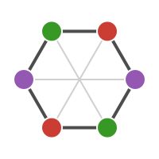

```@raw html
<div style="text-align: center; margin-bottom: 1.5rem;">
  
</div>
```

# FiniteGroups.jl

`FiniteGroups.jl` is a Julia package for the representation theory of finite
groups. Given a group — a crystallographic point group, a symmetric group, or
any group you hand it as a multiplication table — it computes the conjugacy
classes, the character table, and explicit matrix representations, including the
real and projective (double-group) representations that appear in
condensed-matter and molecular-symmetry applications.

The package ships with reference data for the 32 crystallographic point groups:
standard character tables, conventional Mulliken irrep labels, and the
operations' rotation matrices. For those groups you get publication-style tables
immediately. For an arbitrary group everything is computed from the
multiplication table — a fast floating-point eigenvalue method (Burnside) by
default, or an exact finite-field method (Dixon) when you need exact character
values rather than floating point.

## Manual layout

Each guide page is written for human readers and emphasizes conventions,
caveats, and runnable examples; the API reference is generated from the
docstrings and lists exact signatures and defaults.

- [Getting Started](getting-started.md) covers installation and your first
  character table and set of irreps.
- [Constructing Groups](groups.md) shows the three ways to build a group:
  bundled point groups, symmetric/permutation groups, and a raw multiplication
  table.
- [Character Tables](character-tables.md) explains [`charactertable`](@ref) and
  the three methods — the bundled `:table`, floating-point `:burnside`, and
  exact `:dixon`.
- [Representations](representations.md) covers [`irreps`](@ref), real vs complex
  realizations, the regular representation and projectors, decomposition into
  irreducible blocks, and projective / double-group representations.
- [API Reference](api.md) is the docstring-driven signature list.

A reasonable reading order for a new user is Getting Started → Constructing
Groups → Character Tables → Representations.

## A minimal example

Build the point group `D₃` and look at its character table. Rows are
irreducible representations (with conventional labels); columns are conjugacy
classes.

```@example
using FiniteGroups

g = pointgroup("D3")
charactertable(g)
```

The same table can be obtained *exactly*, over a finite field, with Dixon's
method — see [Character Tables](character-tables.md):

```@example
using FiniteGroups

charactertable(pointgroup("D3"); method=:dixon)
```

## Package scope

`FiniteGroups.jl` is focused on the finite, exact, and small-to-moderate regime:
the 32 crystallographic point groups, symmetric groups, and groups small enough
to store a full multiplication table and class-algebra. It is not a
general-purpose computational group theory system (it does not do permutation
group algorithms at GAP scale, presentations, or cohomology). What it does give
you is conventional point-group data out of the box, two character-table
algorithms — one fast, one exact — and explicit real, complex, and projective
representation matrices, in a small codebase you can read end to end.
